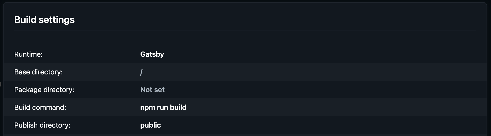

Fork [this repo](https://github.com/bot19/markdown-flashcards) `github.com/bot19/markdown-flashcards` and clone it. On your machine make sure you have Node `v18`, go to the root directory and run `yarn`.

Once all the packages are installed successfully, run it locally with `yarn develop` to see the app in action.

Now it's time to update the app with your data/questions. (1) Update `src/config.ts` with your app/material info and (2) add your .md files to `src/questions`. (3) Then in `gatsby-config.ts` if it isn't already pointing to `/questions`, you'll need to update it:

```typescript
{
  resolve: "gatsby-source-filesystem",
  options: {
    name: "questions",
    path: "./src/questions-tutorial/", // THIS
  },
  __key: "questions",
},
```

(4) Then clear your local storage data and reload to see your new data (open your devTools (F12), Application tab, under Storage > Local storage, right-click your local server URL &amp; `Clear`). If it isn't showing, just restart your local server (in terminal, stop local server and re-run `yarn develop`).

Then head to `netlify.com`, connect your Github account with the cloned repository, select appropriate branch and deploy. My settings are below if you've never done this and need reference:



Now each time you add/edit the questions, just commit (to your netlify deploy branch) and it should automatically deploy. On the app, click the `Update questions` button to get your latest questions (this should work, if it doesn't, try the `reset app` link in the footer additionally).

Any issues, just reach out to me or raise a new issue on github. Pull requests welcomed. Hope this app will help you on your learning journey.

PS: if you want to have different quizs/decks, just use different branches that deploy to different netlify builds (I think that's possible..?), that's how I'm going to do it for now to keep it simple... as I need to get on learning as opposed to just building apps!
