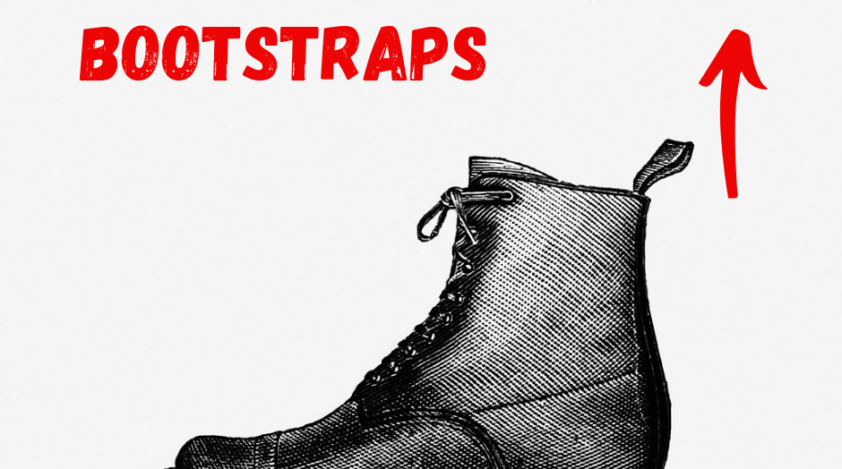

> A loop of leather, cloth, or synthetic material that is sewn at the side or the top rear of a boot to help in pulling the boot on.

> (figuratively) A means of advancing oneself or accomplishing something without aid. (a)

> (idiomatic) To begin an enterprise or recover from a setback without any outside help; to succeed only by one's own efforts or abilities. (b)

1. noun
2. (a) "He used his business experience as a bootstrap to win voters."
3. (b) We can't get a loan, so we'll just have to pull ourselves up by our bootstraps.

