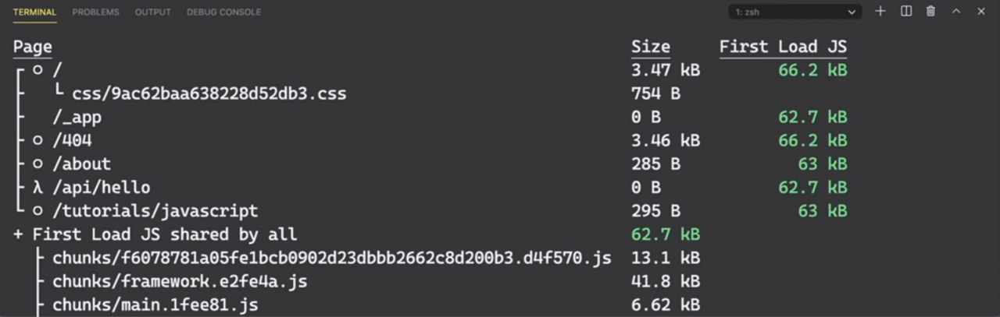
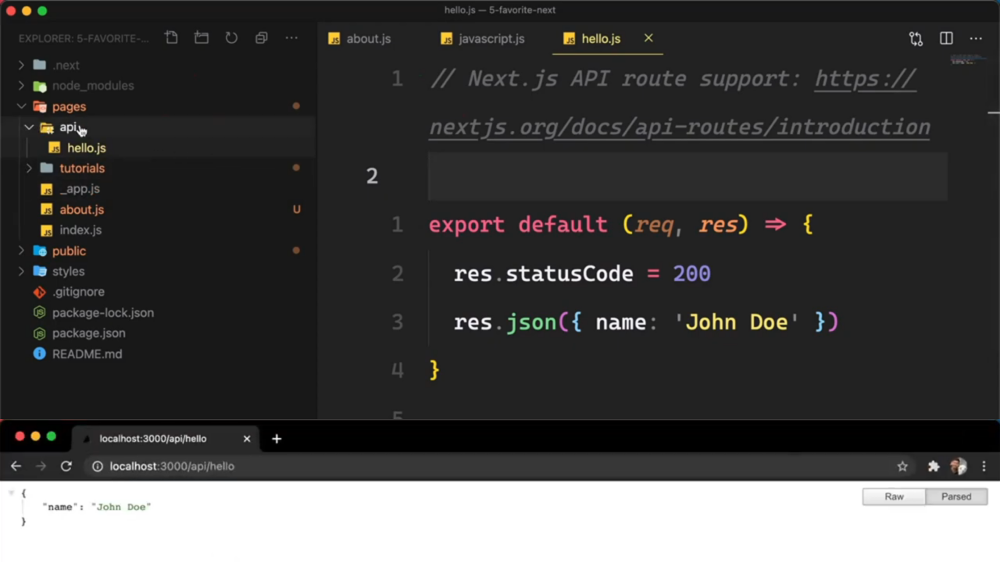
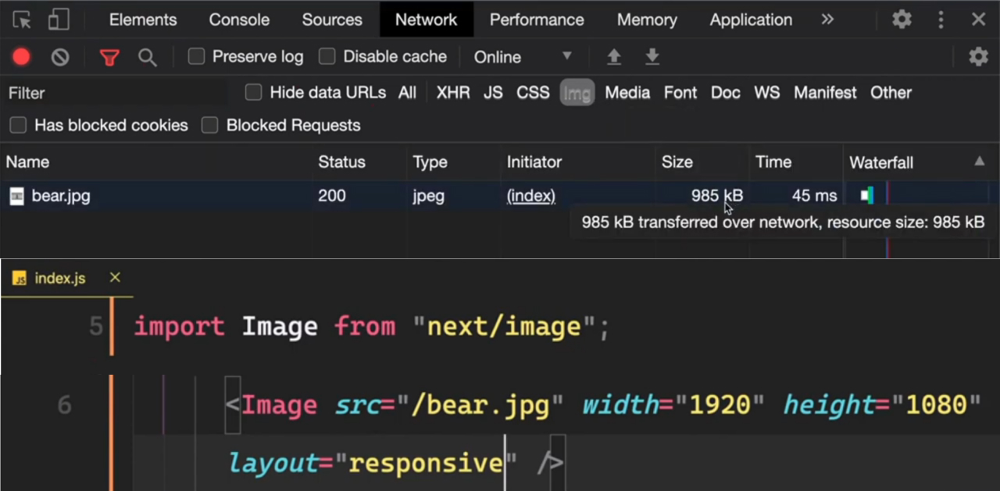
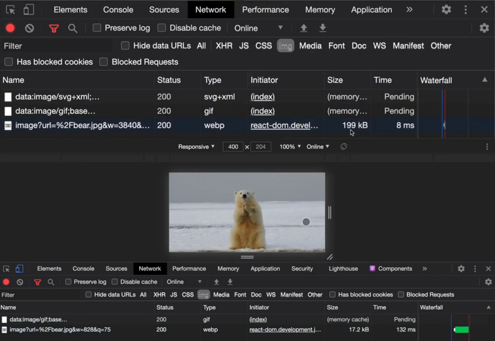

> 5 key features built in by default:
>
> (1) routing (by default)
> (2) automatic code splitting (by default)
> (3) API routes
> (4) image optimisation
> (5) ways to generate website: SSG, SSR, ISR

Source from `2022-05-17`

(1) **Routing**

- page level through file-system
- can also do `/folder/page.js` - files & folder generate the URL for us

(2) **automatic code splitting**

- to do this in react, you'd some some packages like "react loadable" or lazy load some components
- you shouldn't be sending your entire app's JS files to a user if they just want to see 1 page; they shouldn't see the 900 JS files for all pages

(3) **API routes**

- good if you can't do everything you need from inside JS components
- sometimes you need a back-end server to do more processing
- `/api/file.js` in API folder, we are given access to API routes which serverless functions will run, allowing us to use node & all the power node/node packages bring to do stuff inside of `file.js`
- so your front-end can talk to your API you've built all in your next.js app
- use case: use your API to talk to external services like stripe, algolia, where you might have your API secret key, client key securely hidden server-side and not in your front-end

(4) **image optimisation**

- use next.js' image package to optimise images, especially for responsive
- ie: a `985kb` can be optimised to `199kb` and further to `17.2kb` for mobile

(5) **ways to generate website: SSG, SSR, ISR**

- 1-4 you can add to react.js with packages or coding, but unique to next.js (vs react.js) is the way it lets us generate our site
- SSG: Static Site Generation = giant HTML build at build/compile time
- SSR: Server-Side Rendering = dynamic server-side rendering, where your pages are built server-side and served to the client
- ISR: Incremental Static Regeneration = using both SSG & SSR
  - dynamically generate it on the server, everyone who sees this page after that will get a static version
  - can vary in how it is configured, ie: generate all pages statically, but on CMS content update, regenerate that static page with updated content
