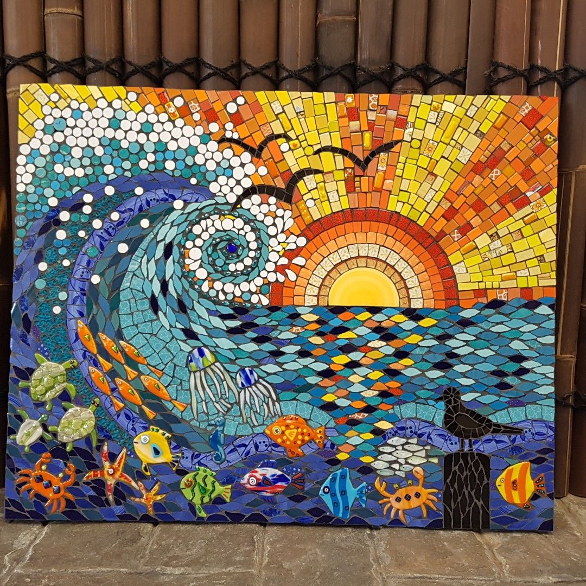

> a pattern or picture made using many small pieces of coloured stone or glass, or the activity or method of making these

> something that forms a pattern consisting of many small coloured areas

1. noun
2. "a beautiful tenth-century mosaic"
3. "On one of the clinic's walls is a mosaic depicting a woman and child wearing traditional clothing."
4. "Mosaic is an ancient art form which can be used to brighten up a corner of your garden."

