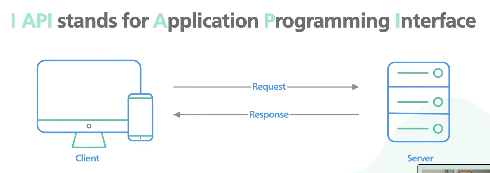

> Application Programming Interface

> APIs are a way for different software systems to communicate with each other and exchange data

### More

- is a set of rules that define how applications or devices can connect to and communicate with each other
