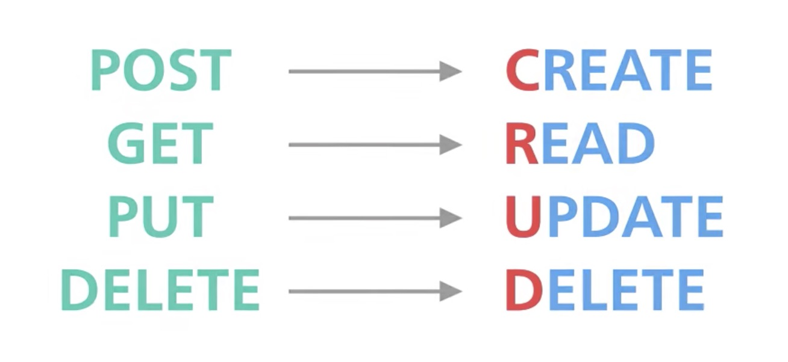
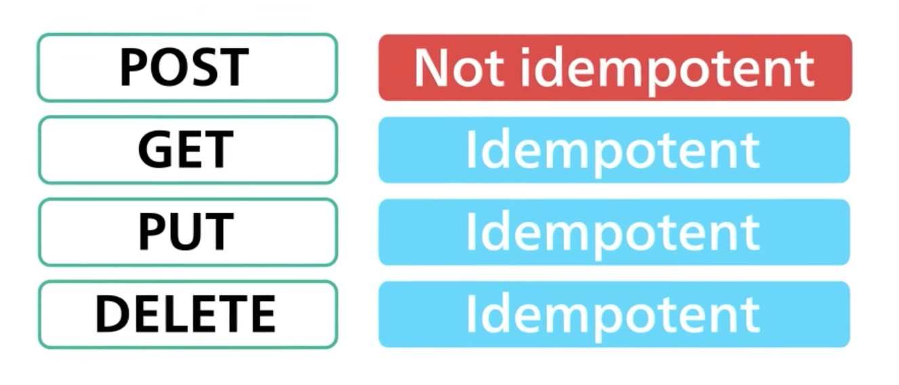

> CRUD refers to the four basic operations a software application should be able to perform – Create, Read, Update, and Delete.

> In such apps, users must be able to **create data**, have access to the data in the UI by **reading** the data, **update** or **edit** the data, and **delete** the data.

> POST, GET, PUT, DEL is the 4 basic operations/CRUD for a REST API

> when an API is idempotent making multiple identical requests has the same effect as making a single request

### more

- In full-fledged applications, CRUD apps consist of 3 parts: an API (or server), a database, and a user interface (UI).
- The API contains the code and methods, the database stores and helps the user retrieve the information, while the user interface helps users interact with the app.
- because some actions are not idempotent, those require extra care when retrying (ie: POST)
