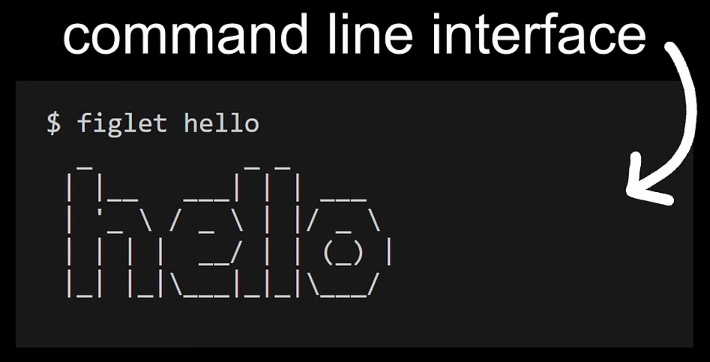

> The command prompt is the string of characters displayed by the terminal emulator program. It indicates to the user that the terminal is ready to accept input that will be sent to the shell. The prompt typically shows information like the current working directory and username.

> It is the terminal emulator program that renders and displays the command prompt to the user. The shell does not directly control or display the prompt itself.

### more

What happens is:

1. The terminal program displays the prompt, usually preceded by the output of a special shell prompt command (e.g. $PS1 in bash).
2. When the user types a command after the prompt, the terminal sends that command to the shell program running behind the scenes.
3. The shell interprets and executes the command, sending any output back to the terminal program to display.

So in essence, while the content of the prompt may be generated by the shell, it is the terminal program's responsibility to visually render and display the prompt for the user's input.
