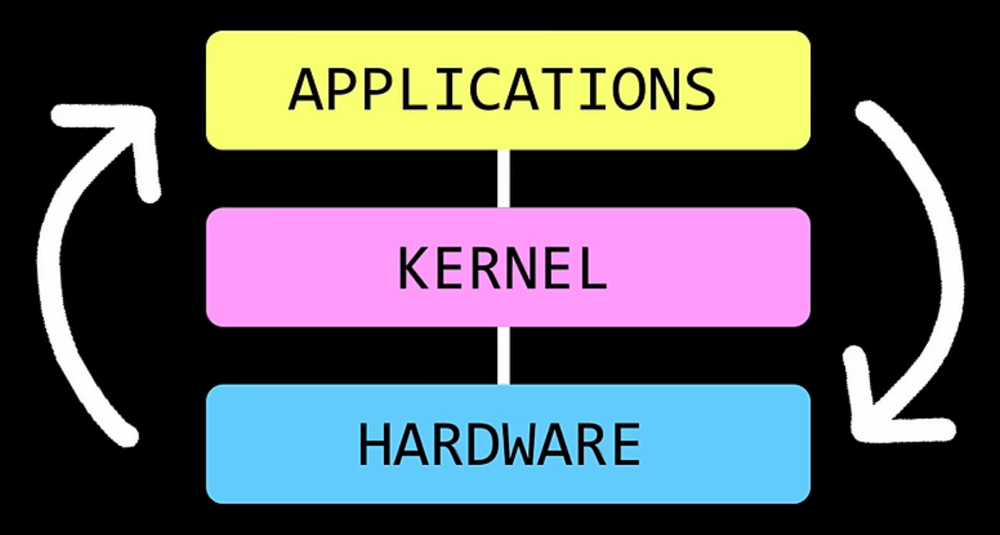
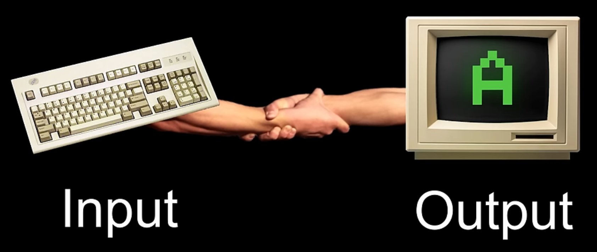

> kernel: the (operating system) kernel sits between computer hardware and applications and manages how they all work together
> ie: with device drivers
> ie: how input and output devices fit together is handled by the kernel

> The kernel is the core component of an operating system. It manages system resources like memory, processes, and devices. It acts as a bridge between the hardware and software.

