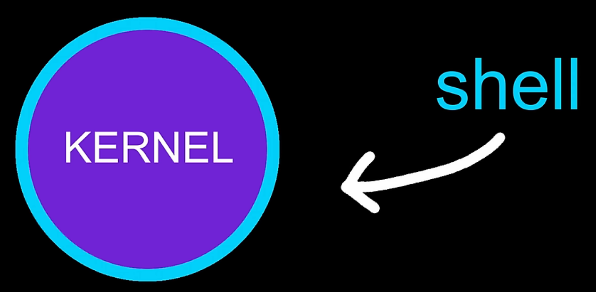

> The "shell" refers to the command interpreter program that runs, receives user input, interprets commands, and interfaces with the operating system kernel.
>
> Programs like bash, zsh, fish, etc. are different implementations or varieties of this shell program. They are not something separate from the shell itself.

> shell: the kernel is wrapped in a shell; which is just a program that exposes the kernel to the user allowing for "simple instructions in a command line interface (CLI) with text input" (not part of the shell)

### more

So in more accurate terms:

- bash (Bourne-Again SHell) is a shell program
- zsh (Z SHell) is a shell program
- fish (Friendly Interactive SHell) is a shell program

They all serve the same core purpose of acting as a command interpreter or shell for the operating system, but have different syntaxes, features, and capabilities.
