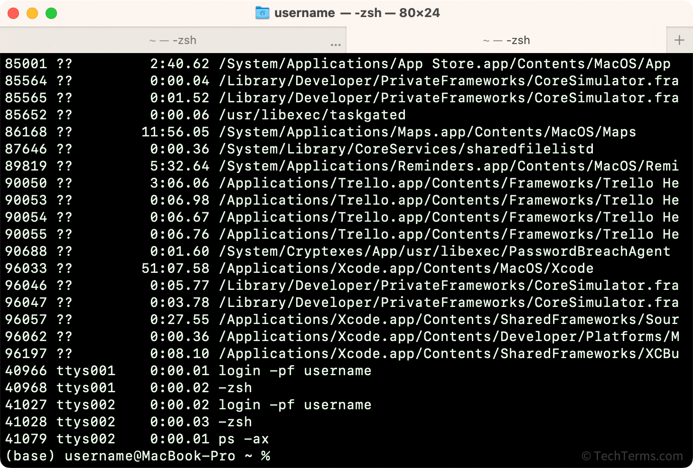

> The terminal emulator program provides the graphical text interface.
>
> When you launch a terminal, it starts an instance of a default shell program behind the scenes, like bash (see more)

> A terminal (emulator) is a program that provides a text-based command line interface to a local or remote computer. Terminal emulators simulate how hardware terminals send text commands, but also include additional features...

### more

#### hardware terminal

Computers in the 1970s were large, expensive machines that were often used in a time-sharing system. Time-sharing allowed multiple people to use a computer at once, splitting its computing resources between everyone and maximizing the amount of work it could do in a day. Users connected to the computer using terminals — simple, low-power devices consisting of a monitor and keyboard, without any built-in computing power. A terminal connected to a remote computer relayed text commands from the user to the computer, then displayed output from the computer on its screen.

Terminals were the primary way most users interacted with computers throughout the 1970s and early 1980s. With the rise of affordable microcomputers in the 1980s, it became more common to interact directly with your own PC instead of sharing a remote computer.

#### terminals & shells

- You can configure the terminal to launch a different shell instead, like zsh or fish)
- Whichever shell is launched, it runs in the background and is responsible for:
  - Displaying a shell prompt in the terminal
  - Interpreting commands typed into the terminal
  - Executing those commands by interfacing with the kernel
  - Rendering any command output back in the terminal
