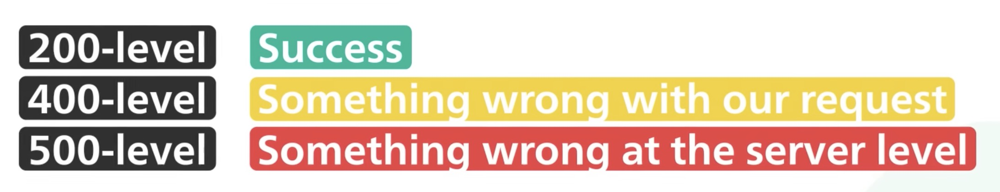

> HTTP (protocol) status codes are numeric codes sent by a server to indicate the status of a client's request.

### more

1. The 200 range indicates successful requests, encompassing codes like 200 OK, 201 Created, etc.
2. The 400 range covers client-side errors like 404 Not Found, 401 Unauthorized; also incorrect requests (ie: wrong syntax)
3. There are also 500 range codes for server-side errors (ie: service unavailable)
4. and other code ranges like 300 for redirects.
