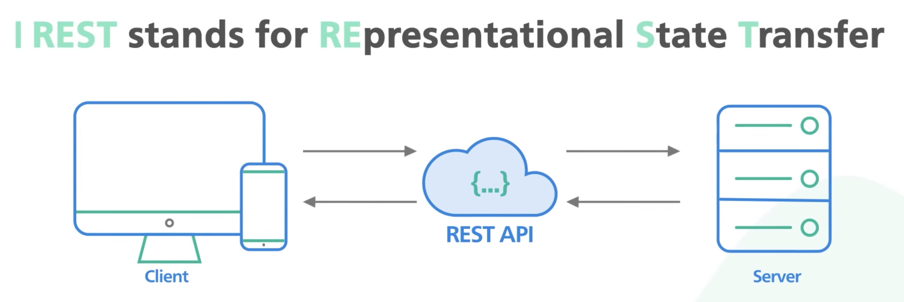
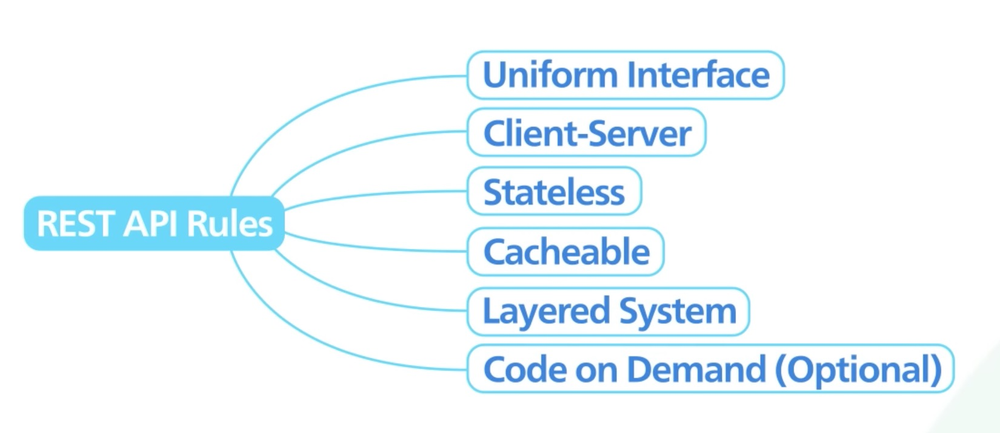
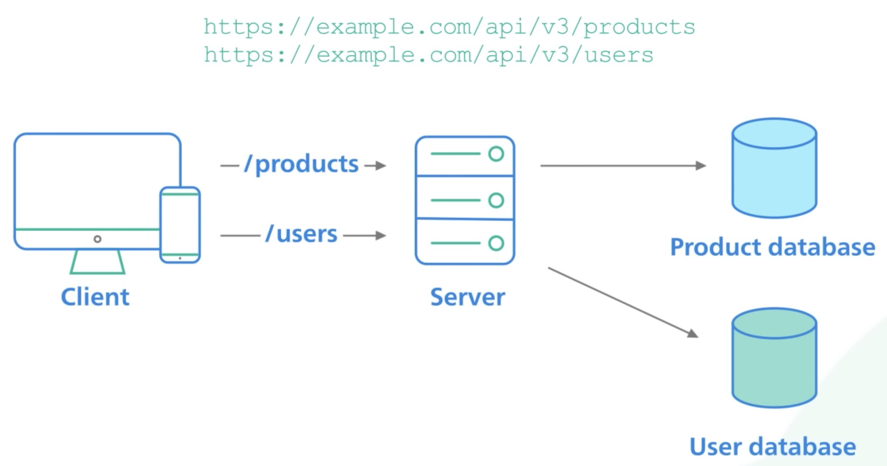
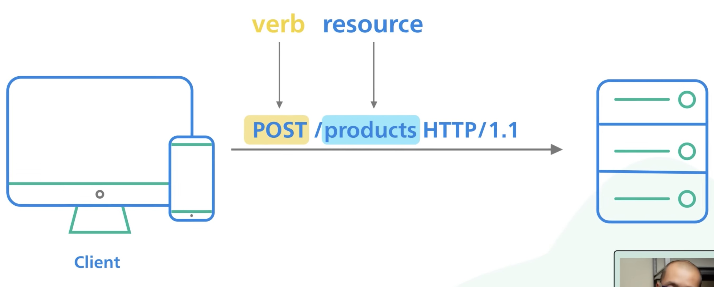
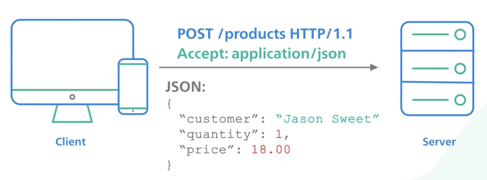
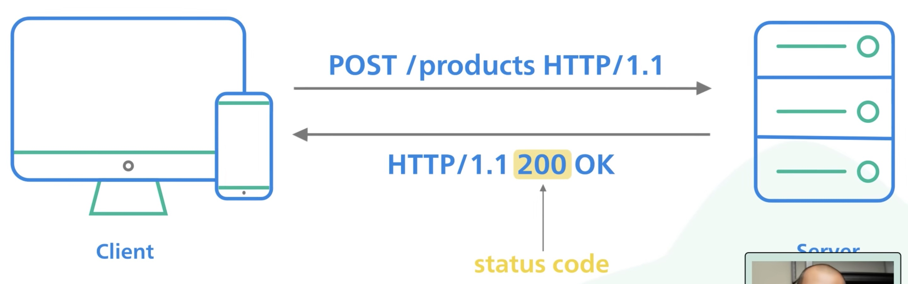
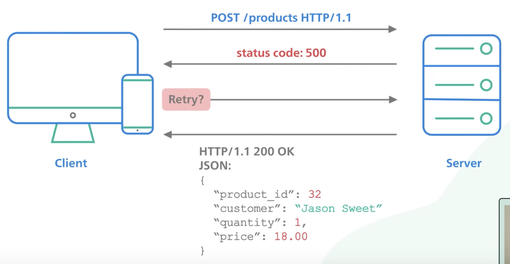
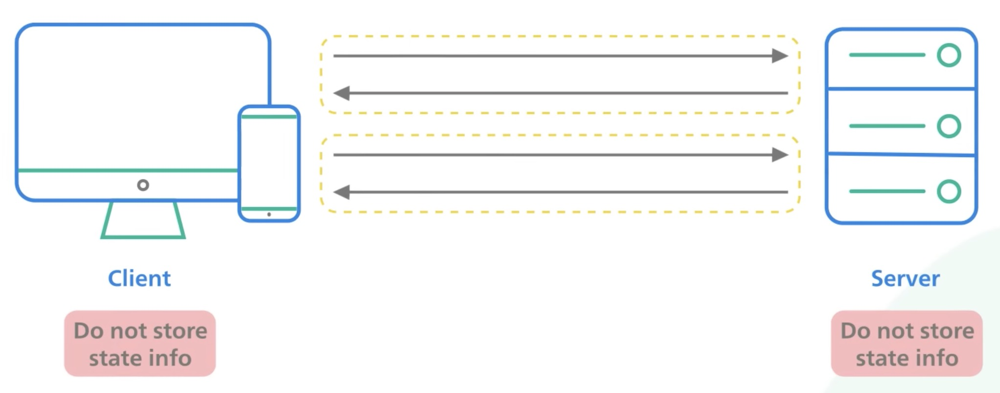

> short for REpresentational State Transfer & is the most common communication standard between computers on the internet, it's used by most mobile/web apps to talk to the server

> not a spec, but a loose set of rules (client-server, stateless, cacheable, etc) that has been the common standard for building web APIs since the 2000s - "RESTful" API if an API follows this standard

> it may not be the best choice for all companies, but it is simple and good enough, that's why it is so widely used; other popular API options: GraphQL, gRPC

---

REST - REpresentational State Transfer

- common API standard used by most mobile & web applications to talk to server
- most common communication standard between computers on the internet

not a spec, but a loose set of rules that has been the common standard for building web APIs since the 2000s

- "RESTful" API if an API follows this standard
- real life ex: twilio, stripe, Google maps

a RESTful API organises resources into a set of unique URIs

a client interacts with a resource by making a request to the endpoint for the resource over HTTP

- the request has a very specific format (below)
- verb = what we want to do with the resource (action), POST = Create

in the body of this request, there could be an optional HTTP request body that contains a custom payload of data usually encoded in JSON

the server receives the request, processes it & formulates the result into a response

- the 1st line of the response contains the HTTP status code to tell the client what happened to the request
  - a well implemented RESTful API will return proper HTTP status codes

a well behaved client could retry a failed request with a 500 level status code

- because some actions are not idempotent, those require extra care when retrying (ie: POST = not idempotent)
- the response body is optional, could contain the data payload, usually formatted in JSON

a REST implementation should be stateless; it means the 2 parties don't need to store any info about each other

- every request & response is independent from all others
- this leads to web apps that are easy to scale + well behaved

**2 final points to discuss to round out a well behaved RESTful API**

(1) using pagination for huge data response

- if an API endpoint returns a huge amount of data - use pagination
- a common pagination scheme: use limit & offset as parameters
- if these params aren't specified, the server should assume sensible defaults

(2) versioning of an API is very important

- versioning allows an API to provide backward compatibility
- so if we introduce breaking changes from 1 version to another, consumers can have enough time to move to the next version
- many ways to version an API; most common is to prefix the version before the resource in the URI

Closing

- RESTful API is simple and effective when applied sensibly
- it may not be the best choice for all companies, but it is simple and good enough, that's why it is so widely used
- other popular API options: GraphQL, gRPC
