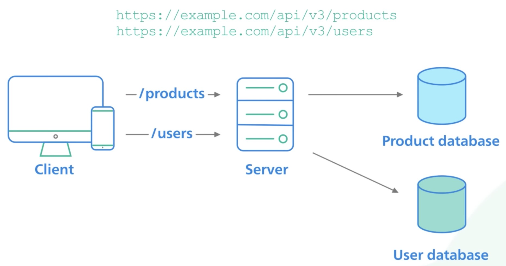

> Uniform Resource Identifiers

> a RESTful API organises resources into a set of unique URIs; URIs differentiate different resources on a server

### more

- resources should be grouped by "nouns" not "verbs"
- API to get all products should just be "products" not "getAllProducts"
